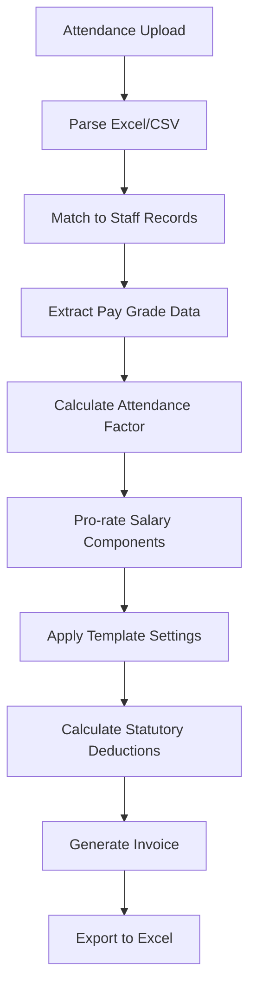

# 🧮 **CURRENT INVOICE CALCULATION SYSTEM - TECHNICAL OVERVIEW**

**Date**: October 2, 2025  
**System Version**: Attendance-Based Invoicing v3.2  
**Documentation Status**: Current Implementation Analysis

---

## 🎯 **OVERVIEW**

The current system processes attendance data through a sophisticated payroll calculation engine that:

1. **Matches attendance to pay grades** (basic level)
2. **Calculates attendance factors** based on working/calendar days
3. **Pro-rates salary components** using attendance factors
4. **Applies invoice templates** for statutory deductions
5. **Generates final invoices** with detailed breakdowns

---

## 📊 **CALCULATION FLOW DIAGRAM**



---

## 🔧 **DETAILED CALCULATION STEPS**

### **STEP 1: Attendance Factor Calculation**

**Formula**: `Attendance Factor = Days Worked ÷ Total Expected Days`

**Pay Basis Types**:

- **Working Days**: Excludes weekends (typically 22 days/month)
- **Calendar Days**: All days in month (28-31 days/month)

**Code Implementation**:

```php
private function calculateAttendanceFactor(int $daysWorked, int $totalDays): float
{
    if ($totalDays === 0) return 0;

    // Cap at 100% (can't work more than total days)
    return min($daysWorked / $totalDays, 1.0);
}
```

**Example Calculation**:

- Employee worked 20 days in October (22 working days)
- Attendance Factor = 20 ÷ 22 = 0.909 (90.9%)

---

### **STEP 2: Base Salary Components Extraction**

**Data Source**: Staff record linked to pay_grade_structure_id

**Components Retrieved**:

```php
$components = [
    'basic_salary' => 150000,        // From pay grade
    'housing_allowance' => 75000,    // From pay grade
    'transport_allowance' => 30000,  // From pay grade
    'meal_allowance' => 15000,       // From pay grade
    // ... other allowances
];
```

**Current Issue**: System pulls salary from staff record, not from pay grade emoluments JSON

---

### **STEP 3: Pro-rated Component Calculation**

**Formula**: `Adjusted Amount = Base Amount × Attendance Factor`

**Implementation**:

```php
private function adjustAllowanceComponents(array $baseSalaryComponents, float $attendanceFactor): array
{
    $adjustedComponents = [];

    foreach ($baseSalaryComponents as $component => $amount) {
        $adjustedAmount = $amount * $attendanceFactor;
        $adjustedComponents[$component] = [
            'base_amount' => round($amount, 2),
            'adjusted_amount' => round($adjustedAmount, 2),
            'attendance_factor' => $attendanceFactor,
            'adjustment' => round($adjustedAmount - $amount, 2)
        ];
    }

    return $adjustedComponents;
}
```

**Example Calculation**:

```
Basic Salary:     ₦150,000 × 0.909 = ₦136,350
Housing:          ₦75,000 × 0.909 = ₦68,175
Transport:        ₦30,000 × 0.909 = ₦27,270
Total Adjusted:   ₦231,795
```

---

### **STEP 4: Gross Salary Calculation**

**Formula**: `Gross Salary = Sum of All Adjusted Components`

```php
private function calculateGross(array $adjustedComponents): float
{
    $gross = 0;
    foreach ($adjustedComponents as $component) {
        $gross += $component['adjusted_amount'];
    }
    return $gross;
}
```

---

### **STEP 5: Statutory Deductions Calculation**

**Template-Driven Calculations** using invoice templates:

#### **5.1 PAYE (Pay As You Earn Tax)**

```php
// Annual calculation with progressive brackets
$annualGross = $grossSalary * 12;
$taxFreeAllowance = 200000 + min($annualGross * 0.01, 200000);
$taxableIncome = $annualGross - $taxFreeAllowance;

// 2025 Nigerian Tax Brackets
$brackets = [
    ['min' => 0, 'max' => 300000, 'rate' => 7],      // 7%
    ['min' => 300000, 'max' => 600000, 'rate' => 11], // 11%
    ['min' => 600000, 'max' => 1100000, 'rate' => 15], // 15%
    ['min' => 1100000, 'max' => 1600000, 'rate' => 19], // 19%
    ['min' => 1600000, 'max' => 3200000, 'rate' => 21], // 21%
    ['min' => 3200000, 'max' => PHP_INT_MAX, 'rate' => 24] // 24%
];
```

#### **5.2 Pension (8% of Pensionable Components)**

```php
// Typically Basic + Housing + Transport
$pensionBase = $adjustedBasic + $adjustedHousing + $adjustedTransport;
$pension = $pensionBase * 0.08; // 8%
```

#### **5.3 Other Statutory Deductions**

```php
$deductions = [
    'nhf' => $grossSalary >= 3000 ? $grossSalary * 0.025 : 0,  // 2.5% if gross >= ₦3,000
    'nsitf' => $grossSalary * 0.01,                            // 1% of gross
    'itf' => ($grossSalary * 12 * 0.01) / 12                   // 1% annual / 12 months
];
```

---

### **STEP 6: Net Salary & Credit to Bank**

**Calculations**:

```php
$netSalary = $grossSalary - array_sum($deductions);
$creditToBank = $grossSalary + array_sum($deductions); // Client pays gross + deductions
```

**Credit to Bank Model**: Client pays total amount, company distributes salary and remits deductions.

---

## 📋 **INVOICE GENERATION PROCESS**

### **Current Implementation** (`InvoiceController::generateAttendanceBasedInvoice()`)

```php
public function generateAttendanceBasedInvoice(Request $request)
{
    // 1. Load attendance upload and client data
    $attendanceUpload = AttendanceUpload::with(['attendanceRecords', 'client'])
        ->findOrFail($request->attendance_upload_id);

    // 2. Get client template settings
    $templateSettings = $this->getClientTemplateSettings($client->id);

    // 3. Process each attendance record through payroll service
    foreach ($attendanceRecords as $record) {
        $employee = Staff::where('employee_code', $record->employee_code)->first();

        $calculation = $this->attendancePayrollService->calculateAdjustedSalary(
            $employee,
            $record->days_worked,
            $client->pay_calculation_basis,
            $templateSettings
        );

        $payrollResults[] = $calculation;
    }

    // 4. Generate final invoice with totals
    $invoice = $this->generateInvoiceFromPayroll($attendanceUpload, $payrollResults);

    return $invoice;
}
```

---

## 🚨 **CURRENT SYSTEM LIMITATIONS**

### **1. Pay Grade Matching Issues**

- ❌ **No automatic matching** of attendance employee codes to staff pay grades
- ❌ **Manual salary entry** still required in attendance upload
- ❌ **No validation** that staff has correct pay grade assignment

### **2. Template System Gaps**

- ⚠️ **Default templates only** - not using actual client-specific templates
- ⚠️ **Static statutory rates** - not pulling from invoice_templates table
- ⚠️ **No template validation** before invoice generation

### **3. Data Source Issues**

- 🔴 **Salary from staff table** instead of pay_grade_structures.emoluments JSON
- 🔴 **No multi-pay grade support** in single invoice
- 🔴 **Missing pay grade template coverage** validation

### **4. User Experience Gaps**

- ❌ **No preview system** before invoice generation
- ❌ **No manual staff addition** to attendance uploads
- ❌ **No supplementary invoice** system for missed staff

---

## 📊 **SAMPLE CALCULATION WALKTHROUGH**

### **Input Data**:

- **Employee**: John Doe (OL Grade)
- **Days Worked**: 20 days
- **Expected Days**: 22 working days
- **Pay Grade**: OL (₦165,000 total compensation)

### **Step-by-Step Calculation**:

**1. Attendance Factor**:

```
20 ÷ 22 = 0.909 (90.9%)
```

**2. Component Adjustment**:

```
Basic Salary:    ₦50,000 × 0.909 = ₦45,450
Housing:         ₦25,000 × 0.909 = ₦22,725
Transport:       ₦70,000 × 0.909 = ₦63,630
Internet:        ₦20,000 × 0.909 = ₦18,180
Total Gross:     ₦149,985
```

**3. Statutory Deductions**:

```
PAYE:           ₦8,999 (calculated annually)
Pension:        ₦10,561 (8% of Basic+Housing+Transport)
NHF:            ₦3,750 (2.5% of gross)
NSITF:          ₦1,500 (1% of gross)
ITF:            ₦1,500 (1% annual ÷ 12)
Total Deductions: ₦26,310
```

**4. Final Amounts**:

```
Gross Salary:    ₦149,985
Net Salary:      ₦123,675 (₦149,985 - ₦26,310)
Credit to Bank:  ₦176,295 (₦149,985 + ₦26,310)
```

---

## 🔄 **ENHANCEMENT OPPORTUNITIES**

### **Immediate Improvements Needed**:

1. **Automatic Pay Grade Matching**

   - Match employee codes to staff records
   - Extract salary from pay_grade_structures.emoluments
   - Validate template coverage

2. **Preview System**

   - Show calculations before invoice generation
   - Allow manual corrections
   - Validate all data

3. **Template Integration**

   - Use actual invoice_templates table
   - Client-specific statutory rates
   - Multi-template support per client

4. **Supplementary Invoice System**
   - Handle missed staff
   - Outstanding invoice tracking
   - Archive system (Sundry)

---

## 📁 **KEY FILES IN CURRENT SYSTEM**

### **Backend Services**:

- `AttendanceBasedPayrollService.php` - Core calculation engine
- `InvoiceController.php` - API endpoints and orchestration
- `InvoiceGenerationService.php` - Invoice creation logic
- `FileProcessingService.php` - Attendance upload processing

### **Database Tables**:

- `attendance_uploads` - File tracking
- `attendance_records` - Individual staff attendance
- `staff` - Employee records with pay_grade_structure_id
- `pay_grade_structures` - Pay scales with emoluments JSON
- `invoice_templates` - Template configurations (underutilized)
- `generated_invoices` - Final invoice records

### **Frontend Components**:

- `InvoiceManagement.jsx` - Template setup interface
- `AttendanceUploadComponent.jsx` - File upload handling
- `InvoiceDashboard.jsx` - Invoice management

---

## 🎯 **NEXT STEPS FOR ENHANCEMENT**

Based on this analysis, the **Enhanced Attendance-Based Invoicing Implementation Tracker** provides a roadmap to address these limitations and create a fully automated, template-driven system that can handle 2000+ staff across multiple pay grades seamlessly.

The focus should be on:

1. **Phase 1**: Pay grade matching automation
2. **Phase 2**: Preview and editing system
3. **Phase 3**: Supplementary invoice management
4. **Phase 4**: Template system enhancement

---

_Technical Analysis completed: October 2, 2025_  
_Next: Begin Phase 1 implementation per tracker_
