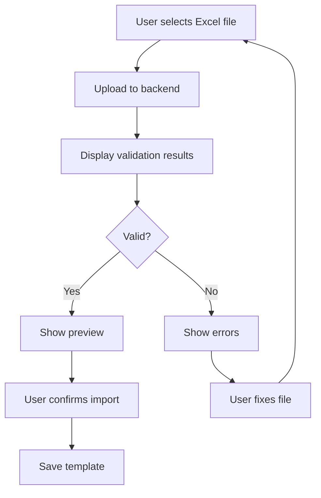
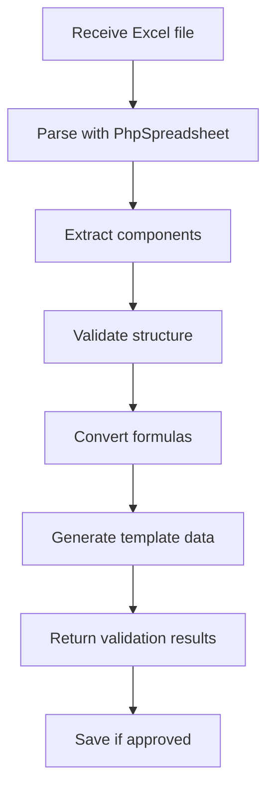

# Excel Template Upload Architecture Design

## 1. System Overview

The Excel Template Upload feature will enhance the existing HRM-ERP invoice template management system by allowing users to import complex payroll templates directly from Excel files. This maintains the existing manual creation workflow while adding powerful automation capabilities.

### Current Architecture Integration

- **Existing**: Manual template creation via `TemplateSetupTab.jsx` → `InvoiceTemplateController.php` → `invoice_templates` table
- **New Addition**: Excel upload → `ExcelTemplateImporter` service → validation → `InvoiceTemplateController` → `invoice_templates` table

## 2. Technical Requirements

### 2.1 Backend Components

#### ExcelTemplateImporter Service (`app/Services/ExcelTemplateImporter.php`)

```php
class ExcelTemplateImporter
{
    public function parseExcelFile(UploadedFile $file): array
    public function validateExcelStructure(array $data): ValidationResult
    public function extractComponents(array $data): ComponentCollection
    public function convertFormulas(array $formulas): array
    public function generateTemplateData(array $components): array
}
```

#### Enhanced InvoiceTemplateController

```php
// New methods to add
public function importFromExcel(Request $request): JsonResponse
public function validateExcelTemplate(Request $request): JsonResponse
public function downloadSampleTemplate(): Response
public function exportToExcel(InvoiceTemplate $template): Response
```

#### Enhanced InvoiceTemplate Model

```php
// New fields to add
protected $fillable = [
    // ... existing fields
    'creation_method', // 'manual' | 'excel_import'
    'excel_filename',
    'import_date',
    'formula_mapping',
    'validation_results'
];
```

### 2.2 Frontend Components

#### ExcelTemplateUpload Component

```jsx
// New component to integrate with TemplateSetupTab
<ExcelTemplateUpload
  onFileSelected={handleFileUpload}
  onValidationComplete={handleValidation}
  onImportComplete={handleImport}
  showPreview={true}
/>
```

#### Enhanced TemplateSetupTab Integration

- Add "Import from Excel" button alongside existing manual creation
- Show upload progress and validation results
- Maintain existing manual workflow unchanged

## 3. Excel File Format Specification

### 3.1 Required Sheet Structure

#### Sheet 1: "Payroll Template"

```
Row 1: Headers
A1: Component Name | B1: Type | C1: Calculation Method | D1: Rate/Amount | E1: Formula

Row 2+: Data
A2: Basic Salary | B2: Allowance | C2: Fixed | D2: 400000 | E2: =400000
A3: Housing Allowance | B3: Allowance | C3: Percentage | D3: 25 | E3: =Basic_Salary*0.25
A4: Transport Allowance | B4: Allowance | C4: Fixed | D4: 50000 | E4: =50000
A5: Pension | B5: Statutory | C5: Percentage | D5: 10 | E5: =Gross_Total*0.10
A6: PAYE | B6: Statutory | C6: Formula | D6: - | E6: =TAX_CALCULATION(Gross_Total)
```

#### Sheet 2: "Metadata" (Optional)

```
A1: Template Name | B1: Corporate Payroll Template
A2: Description | B2: Standard corporate template with all statutory requirements
A3: Version | B3: 1.0
A4: Created By | B4: HR Department
```

### 3.2 Supported Component Types

- **Allowances**: Basic, Housing, Transport, Meal, etc.
- **Statutory**: Pension, PAYE, ITF, NSITF, etc.
- **Management**: Management Fee, VAT, WHT
- **Custom**: Any organization-specific components

### 3.3 Formula Support

- **Simple Percentages**: `=Basic_Salary*0.25` → `25% * Basic_Salary`
- **Fixed Amounts**: `=50000` → `50000`
- **Complex Formulas**: `=(Basic_Salary+Housing)*0.10` → `10% * (Basic_Salary + Housing)`
- **Cell References**: `=C2*0.15` → Convert to component reference

## 4. Validation Rules

### 4.1 File Validation

- Maximum file size: 10MB
- Supported formats: .xlsx, .xls
- Required sheets: "Payroll Template"
- Minimum components: Basic Salary + 1 other component

### 4.2 Data Validation

- Component names: Must be unique, no special characters except underscore
- Calculation methods: Must be 'Fixed', 'Percentage', or 'Formula'
- Rates: Percentage values 0-100, Fixed amounts > 0
- Formulas: Valid Excel syntax, supported functions only

### 4.3 Business Logic Validation

- Total percentage allowances should not exceed reasonable limits
- Statutory components must follow Nigerian labor law requirements
- Basic salary component is mandatory
- Formula references must point to existing components

## 5. Import Process Workflow

### 5.1 Frontend Flow



### 5.2 Backend Processing



## 6. Error Handling Strategy

### 6.1 File Processing Errors

- **Corrupted files**: Clear error message, suggest re-upload
- **Unsupported format**: List supported formats, provide conversion guide
- **Size exceeded**: Display current size vs limit

### 6.2 Data Validation Errors

- **Missing components**: Highlight required fields
- **Invalid formulas**: Show formula errors with suggested fixes
- **Duplicate names**: Provide auto-rename suggestions

### 6.3 Business Logic Errors

- **Percentage overflow**: Show calculation breakdown
- **Missing basic salary**: Highlight requirement, suggest fixes
- **Invalid statutory rates**: Show legal requirements

## 7. Performance Considerations

### 7.1 File Processing

- Use Laravel queues for large files (>5MB)
- Implement progress tracking for user feedback
- Cache parsed results during validation phase

### 7.2 Memory Management

- Process files in chunks for large templates
- Clear temporary data after processing
- Optimize PhpSpreadsheet memory usage

## 8. Security Measures

### 8.1 File Upload Security

- Validate file types using MIME detection
- Scan uploaded files for malicious content
- Store uploaded files in secure, temporary location

### 8.2 Formula Security

- Sanitize Excel formulas before evaluation
- Whitelist allowed Excel functions
- Prevent code injection through formula parsing

## 9. Integration Points

### 9.1 Existing Manual Workflow

- Add "Import from Excel" tab/section to TemplateSetupTab
- Maintain all existing manual creation functionality
- Allow hybrid approach: import base template, manually customize

### 9.2 Database Integration

- Extend `invoice_templates` table with import metadata
- Maintain referential integrity with existing relationships
- Add migration for new fields

### 9.3 API Integration

- Extend existing InvoiceTemplateController routes
- Maintain consistent response format with existing endpoints
- Add proper authentication and authorization

## 10. User Experience Design

### 10.1 Upload Interface

- Drag-and-drop file upload area
- Progress indicators for upload and processing
- Clear validation feedback with actionable suggestions

### 10.2 Preview System

- Side-by-side view: Excel data vs generated template
- Component mapping visualization
- Formula conversion preview
- Edit capability before final import

### 10.3 Error Recovery

- Detailed error explanations with examples
- Downloadable sample templates
- Step-by-step troubleshooting guides

## 11. Sample Templates

### 11.1 Basic Template

- Minimal required components
- Simple percentage calculations
- Clear examples and instructions

### 11.2 Corporate Template

- Comprehensive component set
- Complex formula examples
- Management fees and statutory compliance

### 11.3 Government Template

- Nigerian public sector requirements
- Specific statutory calculations
- Compliance documentation

## 12. Testing Strategy

### 12.1 Unit Tests

- ExcelTemplateImporter service methods
- Formula conversion accuracy
- Validation rule enforcement

### 12.2 Integration Tests

- Full import workflow
- API endpoint functionality
- Database operations

### 12.3 User Acceptance Tests

- Upload various Excel formats
- Error handling scenarios
- Performance with large files

## 13. Deployment Plan

### 13.1 Phase 1: Backend Infrastructure

1. Install PhpSpreadsheet dependency
2. Create ExcelTemplateImporter service
3. Add API endpoints to InvoiceTemplateController
4. Database migrations for new fields

### 13.2 Phase 2: Frontend Integration

1. Create ExcelTemplateUpload component
2. Integrate with TemplateSetupTab
3. Add validation result display
4. Implement preview functionality

### 13.3 Phase 3: Testing & Documentation

1. Comprehensive testing suite
2. User documentation and guides
3. Sample template creation
4. Performance optimization

This architecture provides a robust foundation for Excel template upload while maintaining system integrity and user experience. The design allows for future enhancements while keeping the current manual workflow fully functional.
